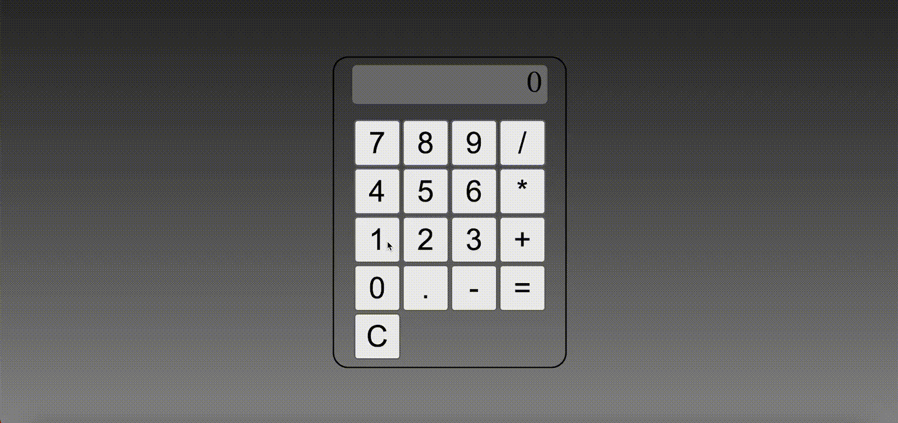

# Simple calculator
HTML, CSS ve JavaScript kullanılarak geliştirilmiş bir hesap makinesi uygulamasıdır. Kullanıcılar bu uygulama ile temel matematiksel işlemleri gerçekleştirebilirler: toplama, çıkarma, çarpma ve bölme.

## Özellikler
- Toplama, çıkarma, çarpma ve bölme işlemleri.
- Kullanıcı dostu arayüz.
- Gerçek zamanlı hesaplama.

## GIF

